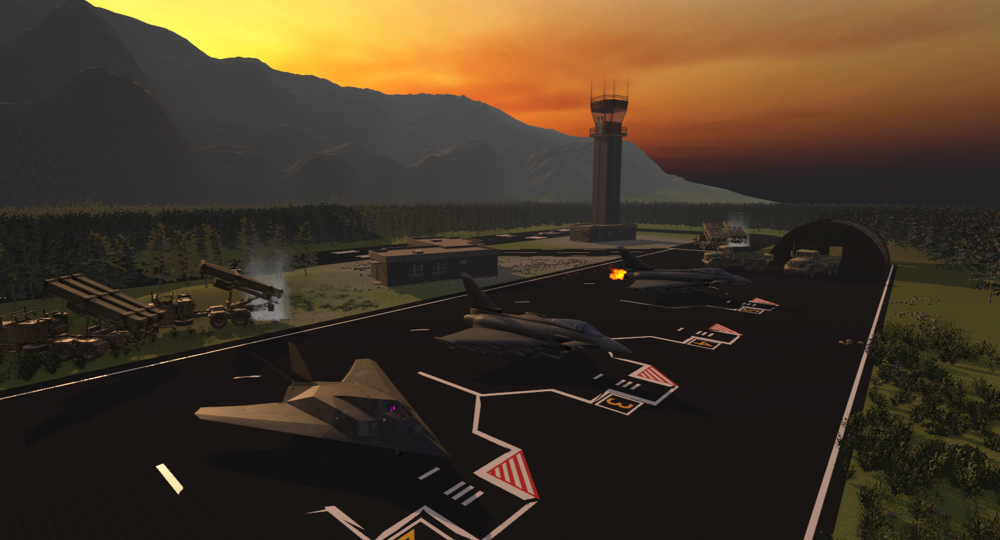

# Dokumentation zum Praktikum

> Praktikum "Virtuelle Realität"  |  Pascal Julian Bornkessel  |  Flug- und Fahrzeuginformatik im 6. Semester

## Blatt 1 - "Roll a Ball" (24.03.2023)
Die Aufgaben 1 bis 6 des Teils "Roll a Ball" sowie die Aufgabe 1 des Teils "Roll a Ball VR" wurden wie beschrieben bearbeitet um das grundlegende Spiel zu erstellen. Die im Zuge der Aufgabe 2 des Teils "Roll a Ball VR" eingebauten Erweiterungen sollen im Folgenden gesondert erläutert werden. 

* **Abprallen** - Es wurde das Abprallen des Balles an den Wänden hinzugefügt. Dafür wurde ein Physical Material "Wall Bounce" erstellt, welches zu den Wänden hinzugefügt wurde. Die Bounciness der Wände wurde dabei auf 1 gesetzt.

* **"feindliche" Pick-Ups** - Einige der gelben Pick-Ups wurden in rote Pick-Ups umgewandelt. Berührt der Ball _zwei mal_ einen roten Pick-Up _hintereinander_, so ist das Spiel beendet. Dies wird realisiert, indem dem Spieler der Ball weggenommen wird.

* **Bewegung** - Für die roten Pick-Ups wurde ein Script erstellt, welches diese mit einer bestimmten Geschwindigkeit vor und zurück bewegt. Dadurch soll die Scheiwrigkeit erhöht werden. Des Weiteren wurde für die gelben und roten Pick-Ups ein Skipt erstellt, durch das diese sich mit einer bestimmten Geschwindigkeit auf dem Board im Kreis bewegen. Dies soll, gerade im Zusammenhang mit den roten Pick-Ups, die Schwierigkeit erhöhen.

* **Levels** - Zur Demonstation der unterschiedlichen Schwrierigkeitsmöglichkeiten durch die Anpassungen wurden drei Level erstellt. Zur Unterscheidung werden dabei unterschiedliche Farben des Boards verwendet.

* **Gestaltung** - Für das Material des Boards und der Wände wurde _Billardfilz_ als Textur verwendet. Für den Boden wurde eine metallische Oberfläche gewählt.

* **Cheating** -  Der Spieler kann schummeln indem er den Ball nimmt und an eine beliebige Stelle des Boards legt, sodass er die roten Pick-Ups nicht berührt.

> Das Video zur Aufgabe 1 ist [hier](https://1drv.ms/u/s!AtQYIMPjZihlgc8rKIlmhtE8WPOdaA?e=dONT6f) auf OneDrive zu finden. (https://1drv.ms/u/s!AtQYIMPjZihlgc8rKIlmhtE8WPOdaA?e=dONT6f)

## Blatt 2 - "Flugsimulator" (31.03.2023)
### Teil 1 - Auswahl des Fluggerätes
Als Fluggerät wurde sich für den _Eurofighter Typhoon_ entschieden. Das Modell wurde von [Sketchfab](https://sketchfab.com/) heruntergeladen und als Autodesk FBX-Datei in Unity importiert.

### Teil 2 - Inspektion
Die Szene zur Inspektion des Fluggerätes erfüllt alle in der Aufgabenstellung (Blatt 2) beschriebenen grundlegenden Anforderungen. Im Folgenden sollen einige Details und Erweiterungen näher beschrieben werden.

* **Verbesserungen am Flugmodell**
     * **Sound** - Es wurde eine 3D-Soundquelle für die laufenden Triebwerke eingebaut.
     * **Partikelsystem** - Es wurde ein Feuer-Partikelsystem hinzugefügt, welche den Nachbrenner darstellen sollen.
     
* **Wechsel zur Cockpit-Szene** - Da der Spieler kleiner ist als das Flugzeug und dadurch nicht das Cockpit erreichen kann, wurde der Wechsel in die Cockpit-Szene durch Bewegung des rechten Carnards (vorne angebrachtes Höhenleitwerk) um 45° eingebaut.
     * **Hand** - Um auf die Möglichkeit des Szenenwechsels hinzuweisen wurde eine weiße Hand hinzugefügt, die per Skript bewegt wird. 
     * **Kommunikation mit Tower** - Der Spieler hört zu Beginn ein Funkspruch des Towers, der ihn auf den Szenenwechsel hinweist. 

* **Szenerie**
     * **Flughafen** - Es wurde ein Flughafen mit Startbahn, Tower, Hangars und Begleitbauwerken in die Szene eingefügt.
     * **Fahrzeuge** - Um den Eindruck eines militärisch genutzten Flughafens zu verstärken, wurden zwei zusätzliche Flugzeuge (ein weiterer Eurofighter und eine Lockheed F-117) sowie weitere Fahrzeuge (militärische Transporter sowie bodengestützte Flugabwehrraketen) hinzugefügt.
     * **Sky-Box** - Es wurde eine Sky-Box hinzugefügt und die Lichtquelle verschoben, um einen Sonnenaufgang darzustellen.
     
* **Terrain**
     * **Gebirge** - In Hintergrund befindet sich ein im Neben eingehüllter Berg.
     * **Bäume und Sträucher**
     * **Wind** - Die Bäume und Sträucher bewegen sich durch den Wind aus nordwestlicher Richtung.

### Teil 3 - Cockpit
Die Szene im Cockpit des Fluggerätes erfüllt alle in der Aufgabenstellung (Blatt 2) beschriebenen grundlegenden Anforderungen wie die das XR Origin im Cockpit oder die WASD-Steuerung. Im Folgenden sollen einige Details und Erweiterungen näher beschrieben werden.

* **Verbesserungen am Flugmodell**
     * **Sound** - Es wurde eine 3D-Soundquelle für die laufenden Triebwerke eingebaut.
     * **Partikelsystem** - Es wurde ein Rauch-Partikelsystem hinzugefügt, welche die Abgase darstellen sollen.
     * **Cockpit** - Da das ausgewählte Flugmodell ein nicht umfangreich modelliertes 3D-Cockpit hatte, wurde ein Cockpit-Modell einer F16 in den Eurofighter eingepflegt.

* **Szenerie**
     * **Sky-Box** - Es wurde eine Sky-Box hinzugefügt, um einen Sonnenaufgang darzustellen.
     * **Nebel** - Zur Landschaft wurde ein leichter Nebel hinzugefügt.

* **Terrain**
     * **Landschaft** - Als Terrain wurde eine bergige Landschaft mit einem Tal in der Mitte gewählt.
     * **Wasser** - Es wurde ein See hinzugefügt. Der See besitzt eine Wasserfläche mit Wellen.

* **Kommunikation mit dem Tower** - Der Spieler hört zu Beginn ein Funkspruch des Towers.

## Blatt 3 - "Flugsimulator" (14.04.2023)
### Teil 1 - Joystick-Steuerung
Die Joystick-Steuerung wurde wie beschrieben in der Szene Cockpit implementiert.

### Teil 2 und 3 - Info-Panel
Es wurde ein Info-Panel erstellt, welches die geforderten Informationen "Höhe" und "Geschwindigkeit" enthält sowie ein Warnungs-Symbol besitzt, welches bei der Unterschreitung der Mindesthöhe aufleuchtet. Das Info-Panel findet sich im Cockpit oder als HUD. Im Folgenden sollen die Erweiterungen näher beschrieben werden.

* **Einfärbung der Höhenangabe** - Die Höhenangabe färbt sich rot, wenn die Mindesthöhe unterschritten wird.

* **Pulsierendes Hinweissybol** - Das Warnungs-Symbol pulsiert, wenn die Mindesthöhe unterschritten wird. Dies wurde mithilfe einer Coroutine realisiert.

* **Akustisches Signal** - Es wird ein akustisches Signal abgespielt, wenn die Mindesthöhe unterschritten wird ("Pull-Up"-Warnung).

### Teil 4 - Erweiterungen
Im Folgenden sollen die umgesetzten Erweiterungen erläutert werden.

* **Holografisches Display** - Im Cockpit des Eurofightes befindet sich ein holografisches Display. Dieses besteht aus einem verkleinerten Eurofighter-Modell und einer Nulllage-Ebene mit Achschen, welche sich bewegt.

* **Monitore** - Im Cockpit befindet sich ein Monitor, welcher eine auf das Heck des Flugzeugs gerichtete Kamera darstellt. Auf diesem Monitor kann der Spieler die Abgase des Flugzeugs (Partikelsystem) oder den Bombenabwurf beobachten.

* **Abwurf von Bomben mit `Fire1`** - Durch drücken des `Fire1`-Button können Bomben abgeworfen werden. Das Abwerfen der Bomben kann im Monitor des Cockpits beobachtet werden.
     * **Unbegrenztes Abwerfen** - Bei jedem Abwurf wird eine neue Instanz erstellt, damit unbegrenzt viele Bomben abgeworfen werden können.

     * **Explosion** - Per Skript wird beim Auftreffen der Bomben auf den Boden eine Explosions-Prefab (Partikelsystem) erzeugt.

* **Bordkanone mit `Fire2`** - Durch drücken des `Fire2`-Buttons wird die Bordkanone aktiviert. Diese wurde ebenfalls mit einem Partikelsystem realisiert.
